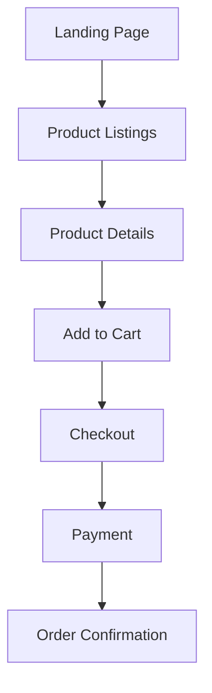

# 🎨 Shoe E-Commerce Website


> **Developed by: Intern Development Team**  
> **Lead Developer:** Tonny Okubasu  
> **Project Manager:** Emmaculate Emali

---

## 🚀 Project Overview

Welcome to the Shoe E-Commerce Website project! Our goal is to create a responsive, intuitive, and scalable shoe-selling platform. This README file will guide you through the setup process, the architecture, and the cool features of this project.

---

## 🛠️ Technologies Used

| Tech Stack | Description |
|------------|-------------|
| **PHP 8**  | Backend, handling core e-commerce functionalities. |
| **MySQL**  | Database for storing product, user, and order details. |
| **HTML/CSS/JS**  | Frontend development. |
| **XAMPP**  | Local development environment. |
| **GitHub**  | Version control. |

---

## 🛒 Features

| Feature                 | Description |
|-------------------------|-------------|
| **Dynamic Product Listings**  | Browse and search through shoes with filters like size, price, brand, etc. |
| **Cart Management**          | Real-time cart updates, without page reloads. |
| **User Accounts**            | Secure authentication for users. |
| **Admin Dashboard**          | Manage inventory, orders, and product listings. |
| **Payment Integration**      | Stripe and PayPal payment options. |

---

## 🎨 Visual Flow of Website

### 🔗 User Journey



---

## 📊 Skills Used

### Frontend Development:
- Building a responsive UI with **HTML/CSS/Bootstrap**.
- Implementing **JavaScript** for interactivity and dynamic updates.
  
### Backend Development:
- Using **PHP 8** for server-side logic and connecting to MySQL.
- Setting up APIs for product management.

### Database Management:
- **MySQL** for data storage.
- Database schema designed to store products, users, orders, and reviews.


---

## 🖥️ Setup Instructions

> This project is configured to run on **XAMPP**. Make sure you have XAMPP installed on your machine.

1. **Clone the Repository**  
   Run the following command to clone the project to your local environment:
   ```bash
   git clone https://github.com/your-repo/shoe-ecommerce.git
   ```

2. **Move the project folder** to `XAMPP`’s `htdocs` directory:
   ```bash
   mv shoe-ecommerce /path/to/xampp/htdocs/
   ```

3. **Start Apache and MySQL** from the XAMPP control panel.

4. **Create the database**:
   - Open **phpMyAdmin** and create a database named `shoe_ecommerce`.

5. **Configure environment settings** in the `.env` file.

6. **Run database migrations**:
   ```bash
   php artisan migrate
   ```

7. **Access the application** via [http://localhost/shoe-ecommerce](http://localhost/shoe-ecommerce).


---

## 🎞️ Animated Demo

Here’s a preview of how some of the key features work:

### 1. **Adding Products to Cart**  


### 2. **Checkout Process**  


### 3. **Sorting and Filtering**  


---

## 📊 Data & Graphical Analysis

We’ve integrated basic analytics into the admin dashboard for tracking:

- **Total Sales**
- **User Growth**
- **Top Products**

Below are examples of the graphical data representations from the platform’s analytics:


---

## 🧑‍💻 Contributing

We follow **Git Flow** for our development process.

- **Fork** this repo.
- **Clone** it to your machine.
- Create a new **feature branch**.
- Push your work and create a **Pull Request**.

---

## 🔮 Future Enhancements

Here are some ideas for future releases:
- **AI-powered recommendations**.
- **Customer reviews and ratings**.
- **Wishlist feature**.
- **Mobile app integration** with the website’s backend.

---

## 📷 Gallery

Check out some of the design previews:


---

